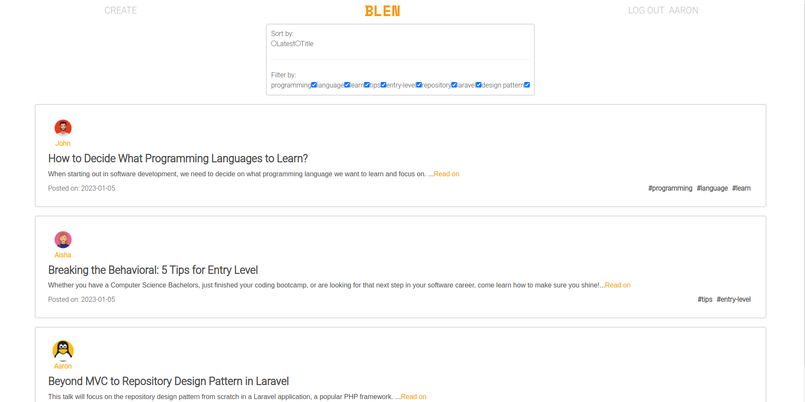
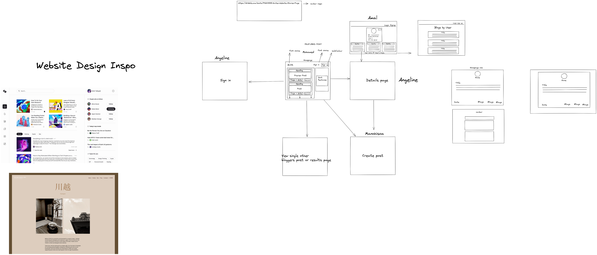
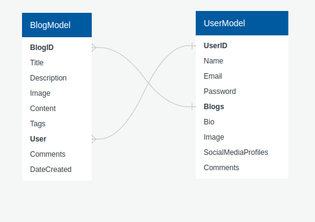

# Project 3: Blen

## Description 
Blen is a full stack blogging app created for users who love writing, reading and tech. It allows users to create, read, update, and delete blogs. It also offers additional functionalities such as the ability to update one’s user profile or filtering events by date, title, or tags. 



## Deployment Link
You can follow this link to try the app:
[Blen](https://bit.ly/3w75ZIL)

## Timeframe and Working Team
This project, which was done as a group (4 people), had a timeframe of 10 days. However, we decided to keep working on it after the project had ended. For 4 days, we worked on some of the issues we could not fix during the given  timeframe. Those issues were:
- filter functionality on homepage
- delete functionality on detail page
- detail, signup, login page css 
- deployment
- image upload to Cloudinary

## Technologies Used
The technologies used for this project were:
- HTML
- CSS
- ReactJS
- Express
- MongoDB
- Mongoose
- NodeJS
- Git
- GitHub
- Visual Studio Code
- Trello
- Excalidraw
- Insomnia

## Brief
The brief for this project stated that we must:
- Build a full stack application by making our own backend and frontend
- Use an Express API to server our data from a Mongo database
- Consume our API with a separate front-end built with React
- Have multiple relationships and CRUD functionalities for at least a couple of models
- Implement thoughtful user stories/wireframes
- Have a visually impressive design
- Be deployed online

## Planning
The first thing we did was discuss the type of app that we would make. One of my partners suggested a recipe app. I suggested a blog app. Another one of my partners agreed with my idea and suggested that we build the app in such a way that users could log in with their Instagram account. The user would then be able to fetch one of their Instagram posts and write a blog about it. The idea was promising. However, we were worried about the timeframe. At the end, we settled down for a blogging app with the main CRUD functionalities; and we decided to add the Instagram functionalities only at the end if time allowed us to do so.

### Wireframing
Once we were settled on an idea, we started working on the wireframe of our app. We discussed the user stories, models, and the pages for our app.



### Models
One of my partners and I met on Zoom to further discuss our models. We discussed the number of models we would need, their structure, and how they would connect. 



### Roles
After we were done with our planning, we divided the tasks and assigned our roles. 

| My Tasks      | Amal | Mohamed | Angeline |
| ----------- | ----------- | ------------------| ---------- |
| CreateBlogPage   | ProfilePage     | HomePage | DetailPage |
| UpdateBlogPage    | Display user blog on profile | Display all blogs| Delete blog functionality |
| Create blog functionality | Update user profile functionality | Filter blogs by date, title and tag | Comment on blog functionality |
| Edit blog functionality | | | |
| | | |

After dividing the tasks, I created the repo. Because our instructor had given us a skeleton for a full stack MERN app, we decided to use that skeleton. I cloned the skeleton, removed the git repo, removed any unnecessary file or code, and pushed it up for my partners to fork and clone. 

## Code Process

### Creating the Models
My partner, Amal, and I had a zoom meeting to revise the structure of our models. After restructuring our models, we created them. 

```
const blogSchema = new mongoose.Schema(
  {
    title: { type: String, required: true },
    description: { type: String, required: true },
    content: { type: String, required: true },
    image: String,
    tags: [String],
    comments: [commentSchema],
    author: { type: mongoose.Schema.ObjectId, ref: "User" },
  },
  {
    timestamps: true,
  }
);
```

My partner added the blogService in the frontend, which was in charge of the asynchronous functions that made requests to our backend. 

Following that, we had a discussion about how we were going to reference the user’s id to the blog post. After a few trial and errors, we managed to reference a user’s id to the blog they created. We did so by reassigning the blog’s author to the user’s id.

```
let userId = req.user._id;
data.author = userId;
```

### Choosing a Text Editor
Before starting to work on the blog controllers to create the blogs, I researched good text editors. We had previously agreed that having a text editor would make writing a blog more practical and genuine. I had a conversation with one of my instructors, and he suggested a text editor called Draft.js. I tried it. However, I had a lot of issues getting the text editor to work. Once it worked, I had issues customizing it. I was also let down when I found out that it was not maintained anymore.

After researching and trying various other text editors, I decided to use the TipTap text editor. I enjoyed the flexibility it offered and how customizable it was. It also worked well with our backend.

### Creating the Blogs
Once I had chosen a text editor, I started working on creating the blogs. I started with the backend. Since the controllers were in the MERN skeleton our instructor provided us, there was little change to be done. Once the blog controller for creating the blog was done, I tested it using Insomnia. 

```
async function createBlog(req, res, next) {
  let userId = req.user._id;
  let filePath;
  try {
    const data = req.body;
    if (req.file) {
      filePath = req.file.path;
      data.image = filePath;
    }
    let currentUser = await User.findById(userId);
    data.author = userId;
    const newBlog = await Blog.create(data);
    currentUser.blogs.push(newBlog._id);
    await currentUser.save();
    res.json(newBlog);
  } catch (error) {
    res.status(400).json(error);
  }
}
```

Once I made sure it worked, I started working on the frontend. I added the state and a few inputs in the CreateBlogPage. I then created a function to update the inputs’ states. Before adding the text editor, I first tested that all the inputs were being updated properly and that they were being saved in the database. However, an issue came up with the way the tags were being saved in the database. I discussed the issue with one of my partners. In the end, we decided to have the tag in the blog model to be an array of string instead of having a separate tag model and referencing it in the blog model. 

After the issue with the tags was resolved, I added the text editor. Then, I had an issue with updating the state for the text editor. Every time I would write in the text editor, the values of the other inputs would reset themselves. It took a bit of time, and a lot of stack overflow, to figure out it was a closure issue. After I managed to solve this issue, the create blog functionality was finished. 

### Displaying the Blog's Content
After saving the blog to the database, I discussed how to display the blog’s content with my partners. To display the blog content, we decided to use an HTMLReact parser.

### Updating the Blogs
The process to update a blog was a lot more straightforward than the process to create a blog. The EditBlogPage was very similar to the CreateBlogPage. The only main differences were in the state’s value. In the CreateBlogPage, the state’s values were empty strings. However, for the EditBlogPage, I first had to fetch the blog’s data, then set the state to that newly fetched data.

### Added Security and Input Validation in the Frontend
After the create and update functionalities were working, I added a bit of security in the frontend. I made it so only logged in user’s could reach the CreateBlogPage, and I made sure that only the blog’s author could reach the EditBlogPage. After adding some security, I added a few input validations. 

### Uploading Images
The image upload functionality was probably the feature I was most nervous and excited about. 
Before actually coding, I spent some time researching the best way to upload and save images. I was in a dilemma about whether to use base64 or the filesystem. After some time and a conversation with one of our instructors, I chose to store the images in a filesystem.

To upload images, I used multer. I spent a lot of time reading the documentation and blogs. I also watched videos on YouTube. These helped me understand what was happening behind the scenes. When I was finally able to upload and store the images in the filesystem, I noticed the images were not being displayed. I looked up solutions online and asked my partners, but I could not find the answer to resolve that issue. I then decided to ask my mentor. He then explained to me that I had not told Express how to serve the static files. 

```
app.use(express.static(__dirname));
```

### Styling
Once the functionalities I worked for were finished, one of my partners and I held a zoom meeting to discuss the styling of our app. We chose the theme and the name of the app. We also styled the NavBar together. 

After styling the NavBar, we each worked on styling our pages and components. The styling for the CreateBlogPage and EditBlogPage were very similar. 

## Challenges

### Uploading Images
Uploading images was definitely one of the biggest challenges I had during this project. I believe the challenge came from me not knowing what was happening behind the scenes. When I had bugs and errors, it was helpful to go back to the documentation and understand what might have been the cause. I especially had a hard time displaying the images. 

### Teamwork
Working in a team turned out to be a lot more challenging than I thought it would be. A lot of times, we had to stop what we were doing and fix bugs that appeared because of the last merge. We lost a lot of precious time because of that. 

### Deployment 
Deploying our app turned out to be more complicated than we thought it would be. We had a lot of issues with the upload image functionality. We deployed our app on Render thinking that it could store our images. However, that was not the case. In the end, we decided to use Cloudinary to store our images. 

## Wins

### Using a Text Editor
Using the text editor in the app was definitely a win. It made the app feel a lot more professional and genuine. I especially had a lot of fun customizing it for our app. 

### Uploading Images
The feature to upload images was also another win. Some time throughout the course, I had doubted whether I would have been able to implement this feature before the deadline. 

### Git Workflow
This was the first project where I could practice the git workflow. I was able to see its importance and necessity when working with a team. It was a great opportunity to practice something that I would most likely use often. It offered great real life experience.

### Deployment
Although the deployment of our app turned out to be quite challenging, I learned a lot through the process. Working together to get the image upload functionality working on the deployed app enabled me to learn a lot about how to store images on a cloud. 

## Key Learnings

### Git Workflow
One of the biggest key learnings I got from working on this project is using the git workflow. I believe this is something that will be used on a day to day basis when working in a team. 

### Backend Debugging
Prior to working on this project, I had some issues pinpointing where exactly the bugs were coming from in the backend. Throughout this project, I was able to get the help of my mentor. He taught me a few tricks to debugging in the backend. One of which was removing the try and catch blocks. 

### Teamwork
Although we had a few challenges come our way because of teamwork issues, I was still able to learn a lot about working in a team. I especially learned a lot through the numerous zoom meetings we held outside of class and the discussions we had.

### Image Storing
While deploying our app, I was able to learn a lot about how to store images on a cloud. Working with images always seemed daunting and intimidating to me, however, with this project, I feel a lot more comfortable working with images. 

## Bugs

### Delete Image Functionality
At the moment, it is possible to delete blogs. However, the images will not be deleted on Cloudinary. 

### Comment Functionality
It is currently not possible to post comments on a blog. Although there is an input for comments, it is not working. 

## Future Improvements

### Styling
Due to the lack of time, we were not able to implement a lot of styling to our app before presenting it in class. However, my partners and I have already decided to work together again to improve the styling of the remaining pages, such as the detail and signup page.

### Component Reusability
The CreateBlogPage and EditBlogPage look very similar. They have the same inputs and styling. At the moment, my code is a bit repetitive, so to make it DRY I would have to create custom inputs to use both in the create and edit page.

### Delete Images
When we deployed our app, we noticed that the delete blog functionality was not deleting the image on Cloudinary. To fix this issue, a change would be necessary in the blog model, more specifically on the image field.


